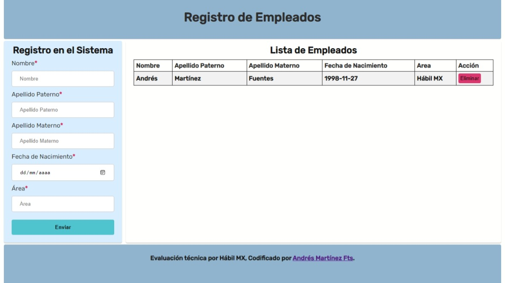

# Technical Evaluation | Hábil Mx

## Table of contents

- [Overview](#overview)
  - [The challenge](#the-challenge)
  - [Screenshot](#screenshot)
  - [Links](#links)  
- [My process](#my-process)
  - [Built with](#built-with)
  - [What I learned](#what-i-learned)
  - [Useful resources](#useful-resources)
- [Author](#author)

## Overview

### The challenge

Crear una tabla (vista) y formulario para registro de empleados que solicite:

1. nombre
2. apellido paterno,
3. apellido materno,
4. fecha de nacimiento y
5. área.

El formulario permitirá agregar nuevos registros (en memoria). Cada registro agregado debe mostrarse en una tabla mostrando los 5 campos y deberá permitir quitar o eliminar un registro en particular desde el listado de empleados (tabla)
Puedes ocupar estilos CSS para poder darle mejor presentación y distribución de los elementos.
Puedes hacer uso de manipulación del DOM o alguna librería o framework
La información queda en memoria.

### Screenshot

Desktop Preview

Responsive Preview

The preview of my solution.

## My process

### Built with

- Semantic HTML5 markup
- CSS custom properties
- Flexbox
- JavaScript
- BEM (Block, Element, Modifier)

## Author

- GitHub - [@AndresMtzF](https://github.com/AndresMtzF)

**Happy Coding**🤖